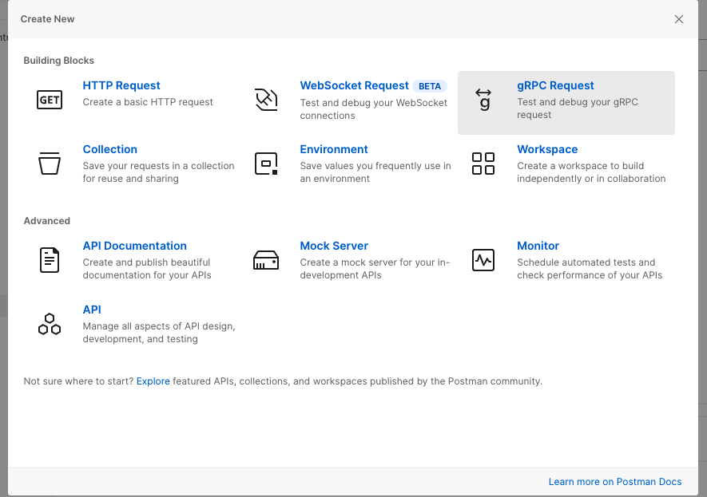
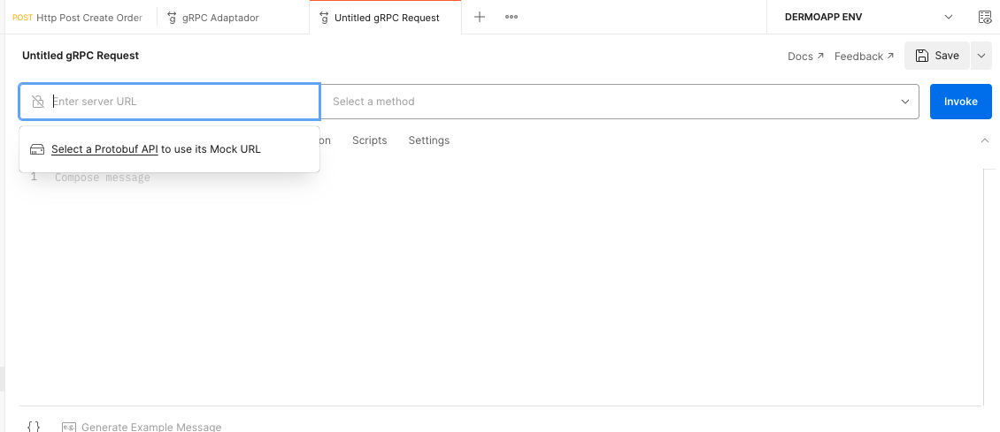
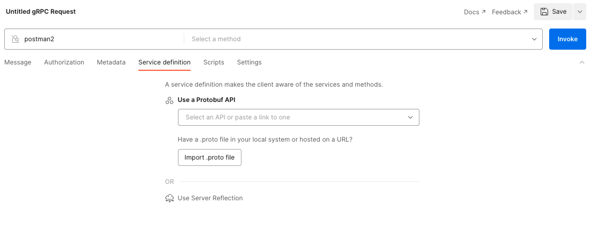
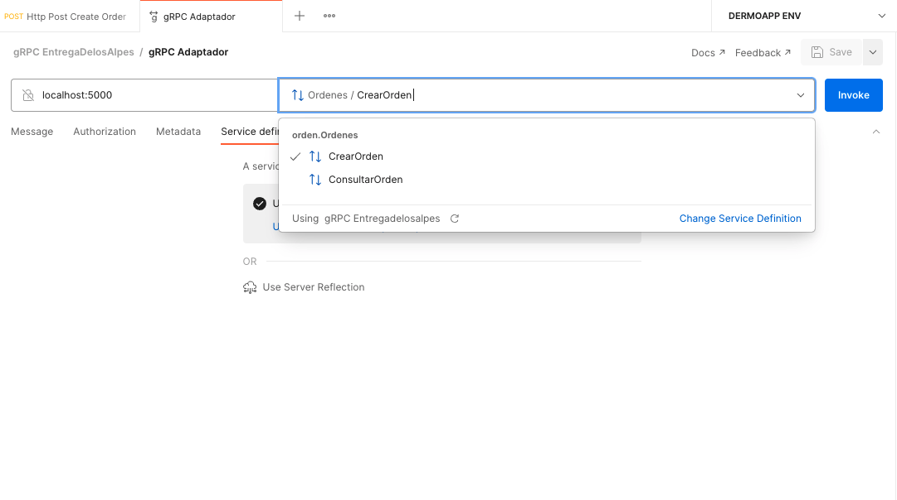
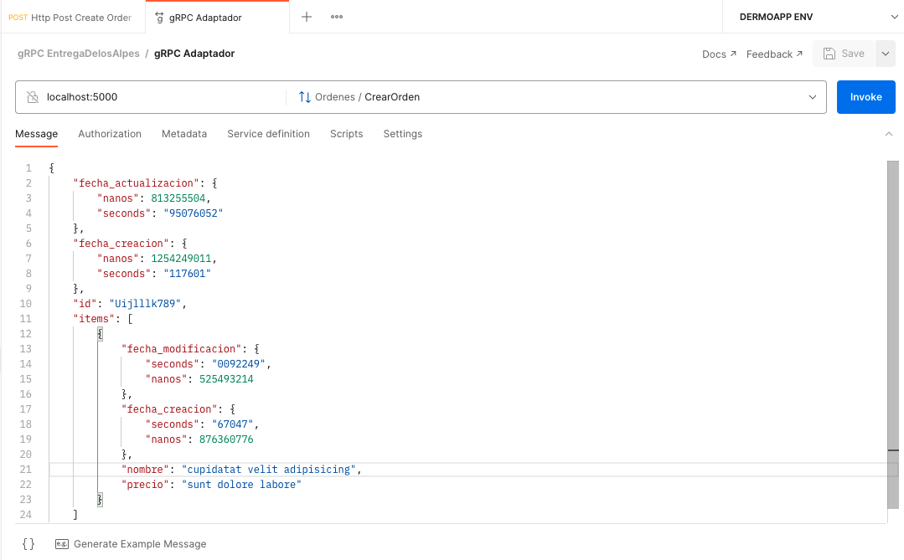

# poc-los-alpes
Repo con el POCs que contiene los microservicios de entregas Los Alpes

## EntregaDelosAlpes
### Ejecutar Aplicación

Desde el directorio principal ejecute el siguiente comando.

```bash
flask --app entregadelosalpes/api --debug run
```

```bash
flask --app authentication/api --debug run
```

### Utilizar una imagen Docker

Desde la carpeta raiz ejecutar el siguiente comando.

```bash
docker build . -f entregadelosalpes.Dockerfile -t entregadelosalpes
```

```bash
docker build . -f auth.Dockerfile -t entregadelosalpes
```

### Ejecutar la imagen docker

Para arrancar la imagen creada en el paso anterior ejecute el siguiente comando.

```bash
docker run -p 5000:5000 entregadelosalpes
```

## Sidecar/Adaptador
### Instalar dependencias

En el archivo `sidecar-requirements.txt`, se encuentran las dependencias de Python para el servidor y el cliente gRPC.

```bash
pip3 install -r sidecar-requirements.txt
```

### Compilar gRPC

Desde la carpeta `sidecar/entregadelosalpes` se ejecuta el siguiente comando.

```bash
python3 -m grpc_tools.protoc -I ./protos --python_out=./pb2py --pyi_out=./pb2py --grpc_python_out=./pb2py ./protos/orden.proto
```
Este genera unos archivos .py y .pyi

### Como ejecutar server

Ingresar a la carpeta sidecar y ejecutar el siguiente comando, en una terminal.

```bash
python3 main.py 
```

### Como ejecutar client (ejemplo)

Ingresar a la carpeta sidecar y ejecutar el siguiente comando, abrir otra terminal.
Este consume un archivo JSON(crear un orden mock) ubicado en la carpeta mensajes

```bash
python3 cliente.py 
```

### Utilizar Docker para ejecutar gRPC

Desde la carpeta raiz ejecutar el siguiente comando.

```bash
docker build . -f adaptador.Dockerfile -t adaptador
```

### Ejecutar la imagen docker con gRPC

Para arrancar la imagen creada en el paso anterior ejecute el siguiente comando.

```bash
docker run -p 50051:50051 adaptador
```

## Docker-compose

Para desplegar todo con `docker-compose`:

```bash
docker-compose up
```
## Probar el consumo gRPC desde Postman

1. Seleccione en Crear Nueva `gRPC Request`, ver imagen


2. Ingrese en hostname y el puerto (localhost:5000)


3. En la opción Service Definition, importe el archivo .proto (sidecar/entregadelosalpes/protos/orden.proto)


4. Una vez importado en la casilla de method se listan aquellos que fueron creados


5. Puedes enviar un mensaje de ejemplo haciendo click en `Generate example message` y luego dar click en el boton Invoke

